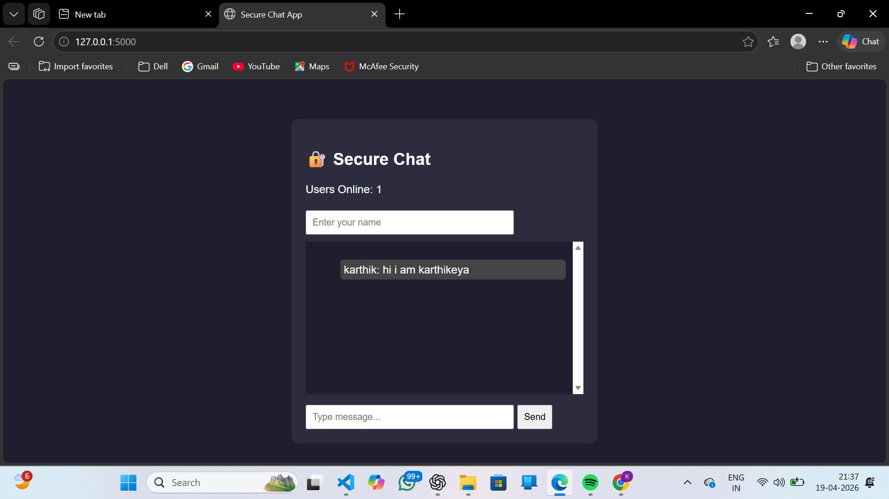

# Secure-chat-app

## Overview

A real-time secure chat application built using Flask and Socket.IO.
It supports encrypted messaging, multiple users, and persistent chat history using a database.

## Features

*  Real-time messaging
*  Encrypted messages using Fernet
*  Username-based chat
*  Online users tracking
*  Chat history storage (SQLite)
*  Clean and simple UI

## Tech Stack

* Python
* Flask
* Flask-SocketIO
* SQLite
* Cryptography (Fernet)
* HTML, CSS, JavaScript

## How to Run

```bash
pip install flask flask-socketio cryptography
python app.py
```

Open in browser:
http://127.0.0.1:5000

## Preview

(Add your screenshot here)

Example:


## Notes

* `secret.key` and `chat.db` are not included for security reasons
* This project is for educational purposes

## Author

Vuppaloju Athri Karthikeya
